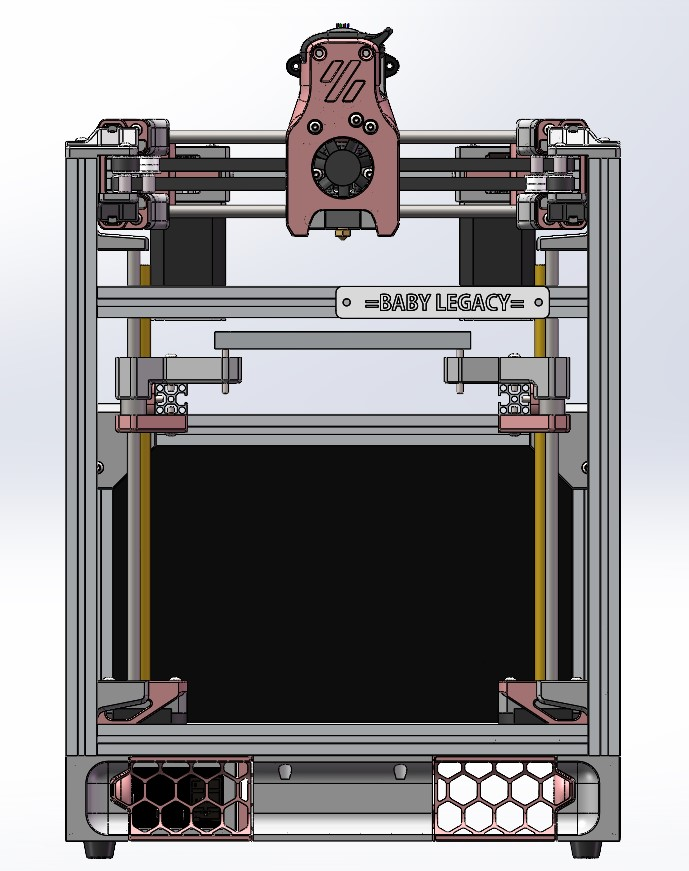

# Baby-Legacy

The Latest STLs haven't updated yet.

最新STL文件未上传。

**NOTICE!!!!!**

**注意！！！！**

**This printer is still a Work in Progress. Files, instructions, and other stuff might change!**

**这玩意还在开发中，零件和说明可能会有所改变！**

### Frame Extrusions

Misumi Part #  |Qty | Notes
 :---|----|----
HFS3-1515-280 |2 | Blind holes need to be drilled
HFS3-1515-240 |4 | Ends need tp be tapped (M3) 
HFS3-1515-280 |2 | Blind holes need to be drilled; Drill a blind hole 67.5mm away from one end 
HFS3-1515-230 |4| Ends need to be tapped (M3)
HFS3-1515-215 |1 |
HFS3-1515-130 |2 |For electronic case.Could be longer for more space. BUT NO LONGER THAN 160mm.
HFS3-1515-80 |2 |

### Linear Shaft

Part  | Qty | Length
-----|----|-----
Linear Shaft 6mm Shaft | 4 | 210mm 
Linear Shaft 6mm Shaft | 4 | 200mm 
 Linear Shaft 6mm Shaft | 2    | 188mm  
 ~~Linear Shaft 6mm Shaft~~ | ~~4~~ | ~~170mm~~ 

## Build plate

Build plate is same as Voron V0 in size of 120*120.

平台规格和Voron 0一样，120*120大小。

## Motor size

Motor size：

- XY motor: NEMA 14 （35步进）

- Z motor: NEMA 17 with 200mm leadscrew（42丝杆电机）

- E motor: NEMA 14 pancake （36圆饼电机）

## Update log

- 2022/10/16

  Add skirt.

[Based on VORON DESIGN LEGACY](https://github.com/VoronDesign/Voron-Legacy)
