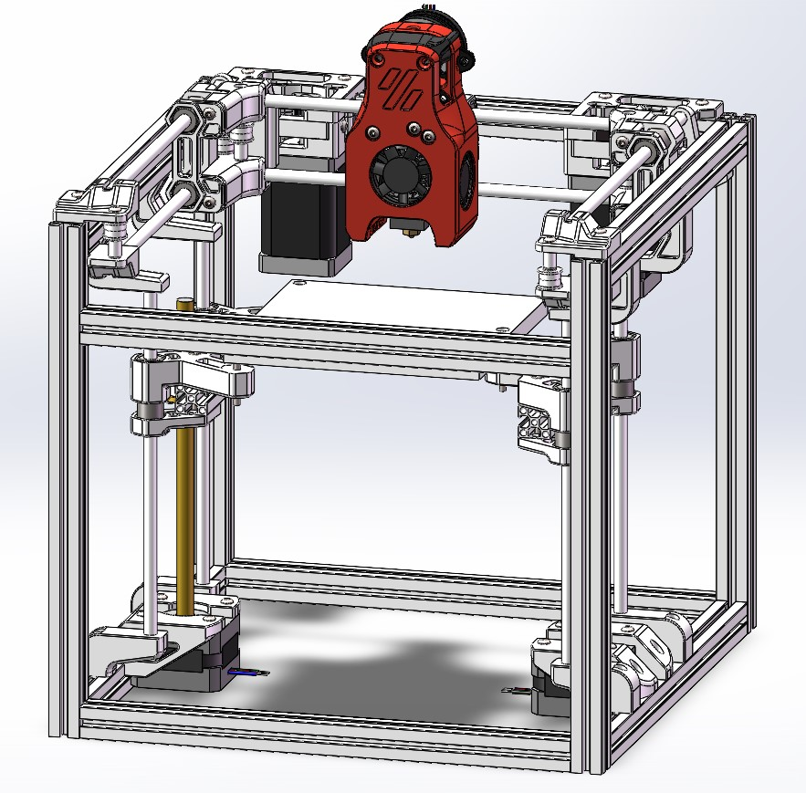

# Baby-Legacy

**NOTICE!!!!!**

**注意！！！！**

**This printer is still a** *** Work in Progress***. **Files, instructions, and other stuff might change!**

**这玩意还在开发中，零件和说明可能会有所改变！**

## Build plate

Build plate is same as Voron V0. 

In size of 120*120.

平台规格和Voron 0一样，120*120大小。

## Motor size

Motor size：

XY motor: NEMA 14 （35步进）

Z motor: NEMA 17 （42丝杆电机）

E motor: NEMA 14 pancake （36圆饼电机）

## Something more...

